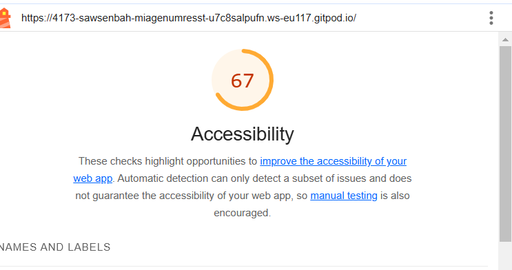

# Q1 : Donner la tailles des fichiers générer par la commande.
Réponse:
polyfills.js (polyfills) : 90.20 kB
main.js (main) : 18.18 kB
styles.css (styles) : 95 bytes
La taille totale initiale est de 108.48 kB.

# Q2 : Donner la tailles des fichiers générer par la commande.
Réponse:
main-FT3QBEBB.js (main) :
Taille brute : 208.48 kB
Taille estimée transférée : 56.93 kB

polyfills-FFHMD2TL.js (polyfills) :
Taille brute : 34.52 kB
Taille estimée transférée : 11.28 kB

styles-5INURTSO.css (styles) :
Taille brute : 0 bytes
Taille estimée transférée : 0 bytes

Taille totale initiale :
Taille brute : 243.00 kB
Taille estimée transférée : 68.21 kB

# Q3 : Est-ce que le fichier est lisible ? Quel est l'intêret de minifier les fichiers d'un point de vue éco-responsable ? Pourquoi on ne minifie pas les fichiers générer en mode dev ?
Réponse:Le fichier est illisble ,  le code a été compressé en supprimant les espaces, les commentaires et en utilisant des noms de variables très courts. 

# Q4 : Donner la tailles des fichiers générer par la commande.
Réponse:
dist/index.html : 0.46 kB │ gzip : 0.30 kB
dist/assets/react-CHdo91hT.svg : 4.13 kB │ gzip : 2.05 kB
dist/assets/index-DZl-RcEH.css : 5.66 kB │ gzip : 1.40 kB
dist/assets/index-C_arIFqf.js : 143.90 kB │ gzip : 46.34 kB

# Q5: Quel est l'intérêt du HMR ?
Réponse:L'HMR  permet de voir les changements instantanément sans recharger la page, tout en conservant l'état de l'application. Cela accélère le développement et facilite les tests.

# Q6: Donner la tailles des fichiers générer par la commande. Pourquoi il faut être vigilant sur les libraires et autre composant qu'on ajoute dans nos applications d'un point de vue éco-responsable ?
Réponse:
index.html: 0.46 kB │ gzip: 0.30 kB
react-CHdo91hT.svg: 4.13 kB │ gzip: 2.05 kB
index-DZl-RcEH.css: 5.66 kB │ gzip: 1.40 kB
index-03z4V8OH.js: 156.75 kB │ gzip: 51.85 kB
Pourquoi être vigilant ?
Réduire la taille des fichiers diminue la consommation d'énergie, l'empreinte carbone et améliore les performances.

# Q7: Noter les nom des différents fichiers qui ont été générés par la commande.
Réponse:
dist/about/index.html
dist/index.html
dist/assets/style-b4SyXn9O.css
dist/assets/about-D08RWGIN.js
dist/assets/style-Dgd37vtf.js
dist/assets/main-BdixoVug.js

# Q8 : Noter les nom des différents fichiers .js qui sont chargés au moment du chargement de la page.
Réponse:
main-BdixoVug.js
style-Dgd37vtf.js

# Q9 : Noter les nom des différents fichiers .js qui sont chargés au moment du changement de page.
Réponse:
about-D08RUGIN.js
style-Dgd37vtf.js

# Q10: Quel est l'intérêt de lu Code Splitting d'un point de vue éco-responsable ?
Réponse:Le Code Splitting réduit la taille des fichiers chargés, limitant ainsi la consommation de ressources et d'énergie, ce qui est plus éco-responsable.

# Q11: Ajouter le screen de votre score :
Screen:

# Q12:  Proposition 1
Description : Utiliser Local Storage pour mettre en cache les questions et propositions afin de réduire les requêtes réseau répétées.

Nb de requêtes total du parcours de l'utilisateur : 16 (au lieu de 29).
Taille totale des requêtes du parcours de l'utilisateur : Réduction significative grâce au cache (économie de 25 requêtes).
Taille totale des requêtes du parcours de l'utilisateur : 124 B (forte réduction).
Taille totale des fichiers générés : Inchangée.

# Q13:  Proposition 2
Description: Remplacer les images GIF par des formats plus optimisés comme WebP  pour réduire la taille de l'image . 
taille avant la modification : 650 B
taille aprés la modif : 12 B

# Q14:  Proposition 3
Description:
Limiter l'affichage des réseaux sociaux à 3 icônes en remplaçant le code par :

  
  
  

Cela réduit le nombre d'icônes chargées, limitant les requêtes HTTP et optimisant la taille totale des ressources.

Taille totale des requêtes du parcours de l'utilisateur:
Réduite de 2.5 kB à 816 B.

# Q15:  Proposition 4 BONUS 
description  :Modifier la méthode evaluate pour ne retourner que les id des propositions au lieu de l'id et label ,  réduisant ainsi la taille de la réponse.
Réduction de la taille des données retournées (seulement id renvoyé).
