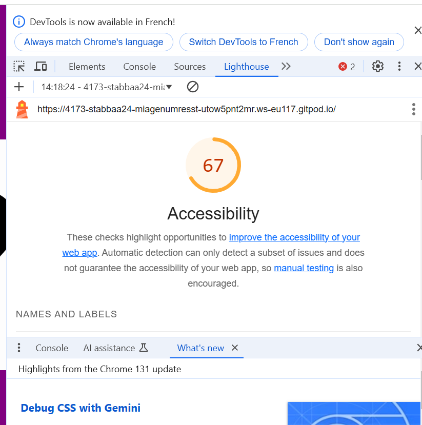

# Q1 : Donner la tailles des fichiers générer par la commande.
Réponse:
polyfills.js        | polyfills     |  90.20 kB | 
main.js             | main          |  18.18 kB | 
styles.css          | styles        |  95 bytes |

Initial total | 108.48 kB

# Q2 : Donner la tailles des fichiers générer par la commande.
Réponse:
main-FT3QBEBB.js      | main          | 208.48 kB | 56.93 kB
polyfills-FFHMD2TL.js | polyfills     |  34.52 kB | 11.28 kB
styles-5INURTSO.css   | styles        |   0 bytes | 0 bytes

Initial total | 243.00 kB |                68.21 kB

# Q3 : Est-ce que le fichier est lisible ? Quel est l'intêret de minifier les fichiers d'un point de vue éco-responsable ? Pourquoi on ne minifie pas les fichiers générer en mode dev ?
Réponse:
- Lisibilité du fichier : Non, le fichier n'est pas facilement lisible car il s'agit d'un fichier JavaScript minifié. La minification rend le texte compact en éliminant les espaces inutiles et en renommant les variables de manière concise, ce qui est difficile à comprendre pour les humains.

- Intérêt éco-responsable de la minification : Minifier les fichiers réduit leur taille, ce qui diminue la bande passante nécessaire pour les transférer. Cela se traduit par une consommation moindre d'énergie sur les serveurs et les réseaux, contribuant ainsi à une approche plus écologique de la gestion des ressources numériques.

- Non-minification en mode développement : En mode développement, les fichiers ne sont pas minifiés pour faciliter le débogage. Les fichiers non minifiés conservent leur formatage et leurs noms de variables compréhensibles, permettant ainsi aux développeurs de lire et de modifier le code plus aisément et de localiser les erreurs efficacement.

# Q4 : Donner la tailles des fichiers générer par la commande.
Réponse:
dist/index.html                   0.46 kB │ gzip:  0.30 kB
dist/assets/react-CHdo91hT.svg    4.13 kB │ gzip:  2.05 kB
dist/assets/index-DZl-RcEH.css    5.66 kB │ gzip:  1.40 kB
dist/assets/index-C_arIFqf.js   143.90 kB │ gzip: 46.34 kB

# Q5: Quel est l'intérêt du HMR ?
Réponse:
- Rapidité de développement : Applique les changements sans recharger la page ce qui accélère le processus de développement.
- Conservation de l'état : Préserve l'état de l'application lors des modifications, évitant la perte de contexte.
- Feedback immédiat : Les modifications sont visibles instantanément ce qui facilit le débogage
- Productivité accrue : Réduit les interruptions et les temps d'attente

# Q6: Donner la tailles des fichiers générer par la commande. Pourquoi il faut être vigilant sur les libraires et autre composant qu'on ajoute dans nos applications d'un point de vue éco-responsable ?
Réponse:
dist/index.html                   0.46 kB │ gzip:  0.30 kB
dist/assets/react-CHdo91hT.svg    4.13 kB │ gzip:  2.05 kB
dist/assets/index-DZl-RcEH.css    5.66 kB │ gzip:  1.40 kB
dist/assets/index-03z4V8OH.js   156.75 kB │ gzip: 51.85 kB

# Q7: Noter les nom des différents fichiers qui ont été générés par la commande.
Réponse:
dist/about/index.html           0.53 kB │ gzip: 0.32 kB
dist/index.html                 0.65 kB │ gzip: 0.37 kB
dist/assets/style-b4SyXn9O.css  2.18 kB │ gzip: 0.79 kB
dist/assets/about-D08RWGIN.js   0.15 kB │ gzip: 0.16 kB
dist/assets/style-Dgd37vtf.js   0.71 kB │ gzip: 0.40 kB
dist/assets/main-BdixoVug.js    3.20 kB │ gzip: 1.14 kB

# Q8 : Noter les nom des différents fichiers .js qui sont chargés au moment du chargement de la page.
Réponse:
https://4173-stabbaa24-miagenumresst-utow5pnt2mr.ws-eu117.gitpod.io/assets/main-BdixoVug.js
https://4173-stabbaa24-miagenumresst-utow5pnt2mr.ws-eu117.gitpod.io/assets/style-Dgd37vtf.js
chrome-extension://bcgbghlhkkhcimckjabgomapgommajen/customScript.bundle.js

# Q9 : Noter les nom des différents fichiers .js qui sont chargés au moment du changement de page.
Réponse:
https://4173-stabbaa24-miagenumresst-utow5pnt2mr.ws-eu117.gitpod.io/assets/about-D08RWGIN.js
https://4173-stabbaa24-miagenumresst-utow5pnt2mr.ws-eu117.gitpod.io/assets/style-Dgd37vtf.js
chrome-extension://bcgbghlhkkhcimckjabgomapgommajen/customScript.bundle.js

# Q10: Quel est l'intérêt de lu Code Splitting d'un point de vue éco-responsable ?
Réponse:
Le Code Splitting permet de diviser un gros fichier JavaScript en plusieurs petits morceaux chargés seulement quand nécessaire. Cela présente plusieurs avantages éco-responsables :

- Réduction de la consommation de données : En chargeant seulement les scripts nécessaires, cela diminue la quantité de données transférées, économisant l'énergie liée à leur transmission.
- Amélioration de la performance : Les pages chargent plus rapidement en ne sollicitant que les ressources nécessaires, réduisant ainsi la consommation d'énergie des appareils et des serveurs.
- Optimisation des ressources serveur : Les serveurs gèrent plus efficacement les demandes avec des fichiers plus petits, diminuant leur consommation énergétique.

# Q11: Ajouter le screen de votre score :
Screen:

# Q12:  Proposition 1
Description:
Nb de requête total du parcours de l'utilisateur:
Taille total des requêtes du parcours de l'utilisateur:
Taille total des fichiers généré :

# Q13:  Proposition 2
Description:
Nb de requête total du parcours de l'utilisateur:
Taille total des requêtes du parcours de l'utilisateur:
Taille total des fichiers généré :

# Q14:  Proposition 3
Description:
Nb de requête total du parcours de l'utilisateur:
Taille total des requêtes du parcours de l'utilisateur:
Taille total des fichiers générés :