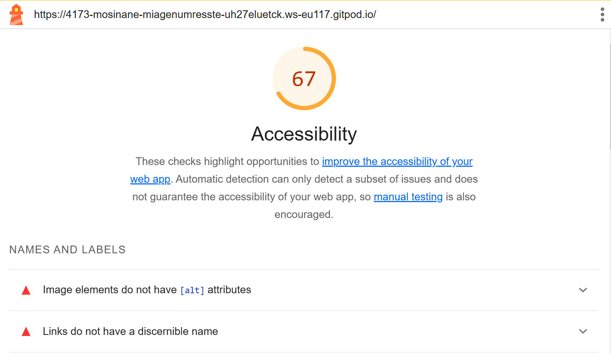
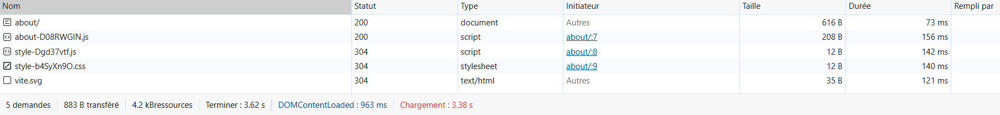

# Q1 : Donner la tailles des fichiers générer par la commande.
Réponse: La taille des fichiers générer par la commande est de 108.48 kB

# Q2 : Donner la tailles des fichiers générer par la commande.
Réponse: La tailles des fichiers générer par la commande est de 243.00 kB

# Q3 : Est-ce que le fichier est lisible ? Quel est l'intêret de minifier les fichiers d'un point de vue éco-responsable ? Pourquoi on ne minifie pas les fichiers générer en mode dev ?
Réponse: Le fichier n'est pas lisible. Il est important de minifier les fichiers car cela améliore la vitesse de chargement du site et ça diminue la taille des fichiers en les regroupants. On ne minifie pas les fichiers générer en mode dev car ils sont ilisible pour les développeurs et donc cela est difficile pour eux de déboguer ou développer avec des fichiers ilisible.

# Q4 : Donner la tailles des fichiers générer par la commande.
Réponse: La taille des fichiers est de 154.15 KB

# Q5: Quel est l'intérêt du HMR ?
Réponse: L'intérêt du HMR permet de charger la page instantanément après avoir enregistrer les modifications du fichiers sans avoir à recharger la page.

# Q6: Donner la tailles des fichiers générer par la commande. Pourquoi il faut être vigilant sur les libraires et autre composant qu'on ajoute dans nos applications d'un point de vue éco-responsable ?
Réponse: La tailles des fichiers générer par la commande est de 167 KB. Il faut être vigilant sur les libraires et autre composant qu'on ajoute dans nos applications car ça peut ralentir la vitesse de chargement du site et on peut vite avoir un gros volume de fichiers pour une petite fonctionnalités fait avec les libraires, il faut se demander si on a vraiment l'utilité.

# Q7: Noter les nom des différents fichiers qui ont été générés par la commande.
Réponse:Les fichiers qui ont été générés ou  transformer par la commande sont index.html, style-b4SyXn90.css, about-D08RWGIN.js, style-Dgd37vtf.js et main-BdixoVug.js 

# Q8 : Noter les nom des différents fichiers .js qui sont chargés au moment du chargement de la page.
Réponse: 

# Q9 : Noter les nom des différents fichiers .js qui sont chargés au moment du changement de page.
Réponse: 

# Q10: Quel est l'intérêt de lu Code Splitting d'un point de vue éco-responsable ?
Réponse: L'intérêt de lu Code Splitting est qu'il réduit la quantité de données transférées et donc réduit la consommation d'énergie, il améliore également la vitesse de chargement des pages

# Q11: Ajouter le screen de votre score :
Screen: 

# Q12:  Proposition 1
Description:
Nb de requête total du parcours de l'utilisateur:
Taille total des requêtes du parcours de l'utilisateur:
Taille total des fichiers généré :

# Q13:  Proposition 2
Description:
Nb de requête total du parcours de l'utilisateur:
Taille total des requêtes du parcours de l'utilisateur:
Taille total des fichiers généré :

# Q14:  Proposition 3
Description:
Nb de requête total du parcours de l'utilisateur:
Taille total des requêtes du parcours de l'utilisateur:
Taille total des fichiers générés :