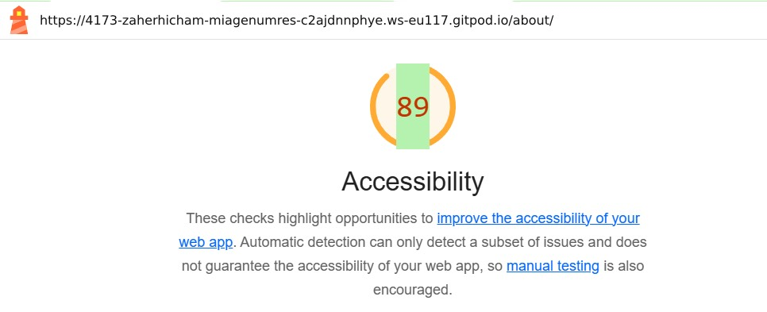

# Q1 : Donner la tailles des fichiers générer par la commande.
Réponse: 108.48 kB

# Q2 : Donner la tailles des fichiers générer par la commande.
Réponse: 243.00 kB

# Q3 : Est-ce que le fichier est lisible ? Quel est l'intêret de minifier les fichiers d'un point de vue éco-responsable ? Pourquoi on ne minifie pas les fichiers générer en mode dev ?
Réponse: Le fichier n'est pas lisible et l'intéret est de consommer moins de ressources en utilisant moins d'espace ça a donc moins d'impact carbone. On ne minifie pas les fichiers générer en mode dev car sinon cela est illisible pour nous et on ne comprend rien au code du coup.

# Q4 : Donner la tailles des fichiers générer par la commande.
Réponse: 154,15 kB

# Q5: Quel est l'intérêt du HMR ?
Réponse: L'intéret est de recharger juste les parties modifié de la page. Cela permet un gain de temps considérable et une conservation de l'état de l'application.

# Q6: Donner la tailles des fichiers générer par la commande. Pourquoi il faut être vigilant sur les libraires et autre composant qu'on ajoute dans nos applications d'un point de vue éco-responsable ?
Réponse: 167 kB

# Q7: Noter les nom des différents fichiers qui ont été générés par la commande.
Réponse:  
dist/about/index.html           0.53 kB │ gzip: 0.32 kB
dist/index.html                 0.65 kB │ gzip: 0.37 kB
dist/assets/style-b4SyXn9O.css  2.18 kB │ gzip: 0.79 kB
dist/assets/about-D08RWGIN.js   0.15 kB │ gzip: 0.16 kB
dist/assets/style-Dgd37vtf.js   0.71 kB │ gzip: 0.40 kB
dist/assets/main-BdixoVug.js    3.20 kB │ gzip: 1.14 kB

# Q8 : Noter les nom des différents fichiers .js qui sont chargés au moment du chargement de la page.
Réponse: 

main-BdixoVug.js
style-Dgd37vtf.js

# Q9 : Noter les nom des différents fichiers .js qui sont chargés au moment du changement de page.
Réponse:

about-D08RWGIN.js
style-Dgd37vtf.js

# Q10: Quel est l'intérêt de lu Code Splitting d'un point de vue éco-responsable ?
Réponse: Cela permet de charger moins de données car seul les parties importantes sont chargés lorsqu'elle sont requises. Cela permet d'optimiser ldes requêtes serveur.
En téléchargeant uniquement ce qui est nécessaire (lazy loading des modules), on évite le gaspillage énergétique lié à des fichiers inutiles qui ne sont jamais utilisés par l’utilisateur.
Réduction de la consommation d’énergie : Moins de données à charger et à traiter.
Optimisation des ressources serveur : Moins de charge pour les serveurs et les centres de données.
Amélioration de la longévité du matériel : Fonctionnement plus fluide sur des appareils anciens ou moins performants.
Accessibilité : Moins d'impact pour les utilisateurs avec une connexion lente ou limitée.

# Q11: Ajouter le screen de votre score :
Screen: 

# Q12:  Proposition 1
Description: Au lieu d'utiliser des images les créer en css quand on peut.
Nb de requête total du parcours de l'utilisateur: 
Taille total des requêtes du parcours de l'utilisateur:
Taille total des fichiers généré : C'est la taille d'avant moins la taille de l'image.

# Q13:  Proposition 2
Description: Proposer seulement 3 réseaux sociaux certains réseaux sociaux sont peu ou pas utilisés par la majorité.
Nb de requête total du parcours de l'utilisateur:
Taille total des requêtes du parcours de l'utilisateur:
Taille total des fichiers généré : La taille d'avant moins la taille du html sans les autres réseaux sociaux.

# Q14:  Proposition 3
Description: On peut récuperer qu'une seule fois les questions et les propositions donc les mettre en cache au lieu de les recupérer a chaque fois que l'utilisateur clique sur une réponse ou sur le quizz.
Nb de requête total du parcours de l'utilisateur:
Taille total des requêtes du parcours de l'utilisateur: 1 seule requête au lieu de plusieurs
Taille total des fichiers générés :