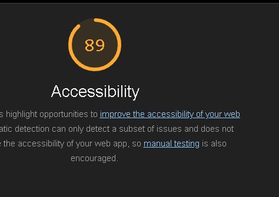

# Q1 : Donner la tailles des fichiers générer par la commande.
Réponse:

Initial chunk files | Names         |  Raw size
polyfills.js        | polyfills     |  90.20 kB | 
main.js             | main          |  18.18 kB | 
styles.css          | styles        |  95 bytes | 

                    | Initial total | 108.48 kB

Application bundle generation complete. [2.234 seconds]

# Q2 : Donner la tailles des fichiers générer par la commande.
Réponse:
Initial chunk files   | Names         |  Raw size | Estimated transfer size
main-FT3QBEBB.js      | main          | 208.48 kB |                56.93 kB
polyfills-FFHMD2TL.js | polyfills     |  34.52 kB |                11.28 kB
styles-5INURTSO.css   | styles        |   0 bytes |                 0 bytes

                      | Initial total | 243.00 kB |                68.21 kB

Application bundle generation complete. [9.304 seconds]

# Q3 : Est-ce que le fichier est lisible ? Quel est l'intérêt de minifier les fichiers d'un point de vue éco-responsable ? Pourquoi on ne minifie pas les fichiers générés en mode dev ?
Réponse:
Non, le fichier n'est pas facilement lisible lorsqu'il est minifié. Minifier les fichiers réduit leur taille, ce qui diminue la bande passante nécessaire pour les transférer et réduit ainsi l'empreinte carbone. En mode développement, les fichiers ne sont pas minifiés pour faciliter le débogage et la lecture du code par les développeurs.

# Q4 : Donner la tailles des fichiers générer par la commande.
Réponse:
dist/index.html                   0.46 kB │ gzip:  0.30 kB
dist/assets/react-CHdo91hT.svg    4.13 kB │ gzip:  2.05 kB
dist/assets/index-DZl-RcEH.css    5.66 kB │ gzip:  1.40 kB
dist/assets/index-C_arIFqf.js   143.90 kB │ gzip: 46.34 kB
✓ built in 877ms

# Q5: Quel est l'intérêt du HMR ?
Réponse:
Le Hot Module Replacement (HMR) permet de mettre à jour les modules d'une application en cours d'exécution sans recharger toute la page. Cela améliore l'efficacité du développement en réduisant le temps de rechargement et en préservant l'état de l'application, ce qui est particulièrement utile pour le développement d'interfaces utilisateur interactives.

# Q6: Donner la tailles des fichiers générer par la commande. Pourquoi il faut être vigilant sur les libraires et autre composant qu'on ajoute dans nos applications d'un point de vue éco-responsable ?
Réponse:
dist/index.html                   0.46 kB │ gzip:  0.30 kB
dist/assets/react-CHdo91hT.svg    4.13 kB │ gzip:  2.05 kB
dist/assets/index-DZl-RcEH.css    5.66 kB │ gzip:  1.40 kB
dist/assets/index-03z4V8OH.js   156.75 kB │ gzip: 51.85 kB
✓ built in 952ms

Il faut être vigilant sur les librairies et autres composants ajoutés dans nos applications car ils peuvent augmenter significativement la taille des fichiers générés. Une taille de fichier plus grande nécessite plus de bande passante pour le transfert, ce qui augmente la consommation d'énergie et l'empreinte carbone. En choisissant des librairies légères et en éliminant les dépendances inutiles, on peut réduire l'impact environnemental de nos applications.

# Q7: Noter les nom des différents fichiers qui ont été générés par la commande.
Réponse:
dist/about/index.html           0.53 kB │ gzip: 0.32 kB
dist/index.html                 0.65 kB │ gzip: 0.37 kB
dist/assets/style-b4SyXn9O.css  2.18 kB │ gzip: 0.79 kB
dist/assets/about-D08RWGIN.js   0.15 kB │ gzip: 0.16 kB
dist/assets/style-Dgd37vtf.js   0.71 kB │ gzip: 0.40 kB
dist/assets/main-BdixoVug.js    3.20 kB │ gzip: 1.14 kB
✓ built in 112ms

# Q8 : Noter les nom des différents fichiers .js qui sont chargés au moment du chargement de la page.
Réponse:
main-BdixoVug.js
style-Dgd37vtf.js
content.js
executor.js

# Q9 : Noter les nom des différents fichiers .js qui sont chargés au moment du changement de page.
Réponse:
about-D08RWGIN.js
style-Dgd37vtf.js
content.js
executor.js

# Q10: Quel est l'intérêt du Code Splitting d'un point de vue éco-responsable ?
Réponse:
Le Code Splitting permet de diviser le code en morceaux qui peuvent être chargés à la demande. Ca réduit la quantité de code initialement chargée, ce qui diminue le temps de chargement et la bande passante nécessaire ca réduit la consommation d'énergie et l'empreinte carbone, car moins de données sont transférées et traitées par les serveurs et les appareils des utilisateurs.

# Q11: Ajouter le screen de votre score :
Screen:

# Q12:  Proposition 1
Description:
Nb de requête total du parcours de l'utilisateur:
Taille total des requêtes du parcours de l'utilisateur:
Taille total des fichiers généré :

# Q13:  Proposition 2
Description:
Nb de requête total du parcours de l'utilisateur:
Taille total des requêtes du parcours de l'utilisateur:
Taille total des fichiers généré :

# Q14:  Proposition 3
Description:
Nb de requête total du parcours de l'utilisateur:
Taille total des requêtes du parcours de l'utilisateur:
Taille total des fichiers générés :