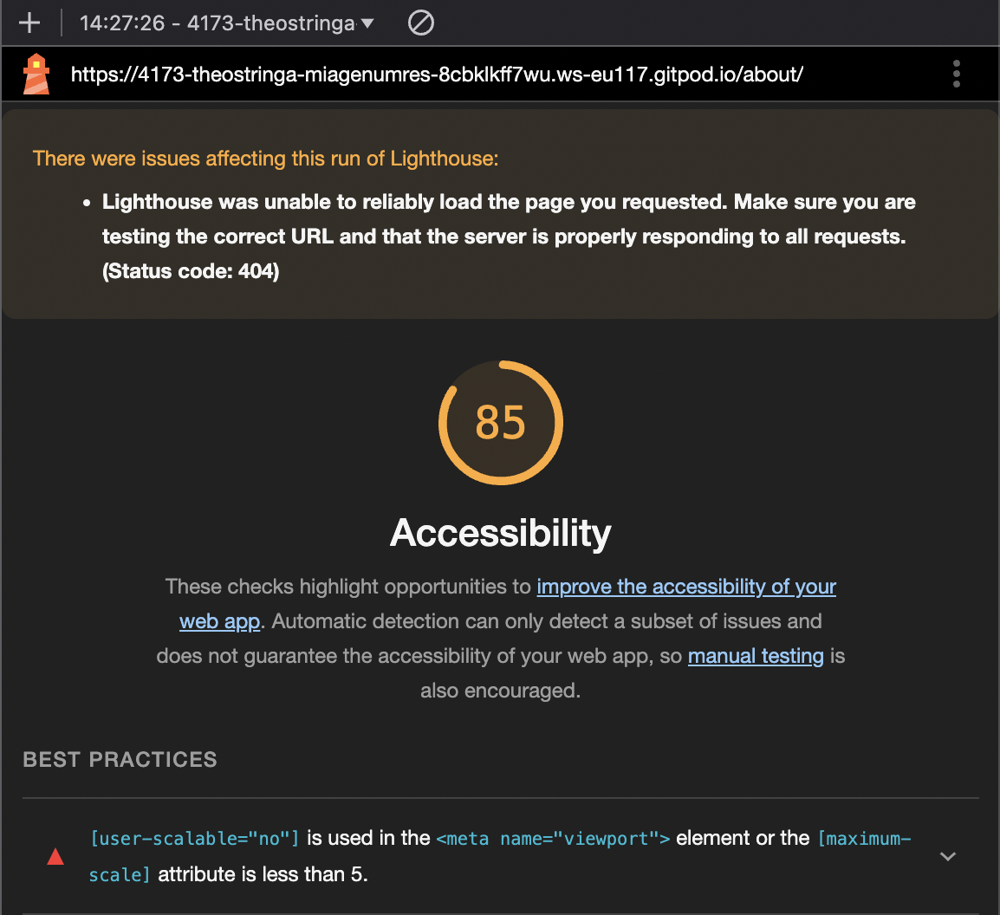

# Q1 : Donner la tailles des fichiers générer par la commande.
Réponse:
Réponse :
| Nom du fichier    | Taille brute (Raw size) |
|--------------------|------------------------|
| polyfills.js       | 90.20 kB              |
| main.js            | 18.18 kB              |
| styles.css         | 95 bytes              |

Total initial : 108.48 kB

# Q2 : Donner la tailles des fichiers générer par la commande.
Réponse:
| Nom du fichier             | Raw size        | Estimated transfer size |
|-----------------------------|-----------------|-------------------------|
| main-FT3QBEBB.js            | 208.48 kB       | 56.93 kB                |
| polyfills-FFHMD2TL.js       | 34.52 kB        | 11.28 kB                |
| styles-5INURTSO.css         | 0 bytes         | 0 bytes                 |

**Total :**  
- Raw size : **243.00 kB**  
- Transfer size : **68.21 kB**

# Q3 : Est-ce que le fichier est lisible ? Quel est l'intêret de minifier les fichiers d'un point de vue éco-responsable ? Pourquoi on ne minifie pas les fichiers générer en mode dev ?
Réponse:
- **Est-ce que le fichier est lisible ?**  
  Non, le fichier `main-FT3QBEBB.js` est **minifié**, ce qui signifie que le code est compacté et difficilement lisible pour un humain. Les espaces, indentations et noms de variables inutiles ont été supprimés.

- **Quel est l'intérêt de minifier les fichiers d'un point de vue éco-responsable ?**  
  Minifier les fichiers permet :  
  - **Réduction de la taille des fichiers** : Cela diminue la quantité de données transférées entre le serveur et le client.  
  - **Réduction de la consommation de bande passante** : Moins de données à transférer signifie une utilisation plus faible des ressources réseau.  
  - **Réduction du temps de chargement des pages** : Les utilisateurs bénéficient d’une expérience plus fluide et rapide.  
  - **Réduction de l'empreinte carbone** : Moins de données transférées réduit la consommation d'énergie des serveurs et des terminaux utilisateurs, ce qui est bénéfique pour l'environnement.

- **Pourquoi on ne minifie pas les fichiers générés en mode dev ?**  
  - En mode développement, il est important que le code reste **lisible** pour faciliter le débogage.  
  - Les développeurs doivent pouvoir comprendre facilement le code source.  
  - Le **Hot Module Replacement (HMR)**, qui permet de recharger une partie du code sans redémarrer l’application entière, fonctionne mieux avec des fichiers non minifiés.  
  - La minification introduit une étape supplémentaire qui ralentirait le développement.
# Q4 : Donner la tailles des fichiers générer par la commande.
Réponse:
| Nom du fichier    | Taille brute (Raw size) |
|--------------------|------------------------|
| polyfills.js       | 90.20 kB              |
| main.js            | 18.18 kB              |
| styles.css         | 95 bytes              |

**Total initial : 108.48 kB**

# Q5: Quel est l'intérêt du HMR ?
Réponse:
Le **Hot Module Replacement (HMR)** permet de recharger uniquement les parties du code qui ont été modifiées, sans avoir besoin de recharger l'ensemble de l'application.

**Les avantages du HMR sont :**
- **Gain de temps** : Les modifications apparaissent instantanément sans redémarrer tout le serveur.
- **Expérience fluide** : L'état de l'application n'est pas perdu (par exemple, les formulaires remplis ou les variables d'état sont conservés).
- **Développement plus rapide** : Les développeurs peuvent tester leurs modifications immédiatement, ce qui accélère le cycle de développement.
- **Moins de consommation de ressources** : Cela évite les compilations complètes et réduit les ressources nécessaires.
# Q6: Donner la tailles des fichiers générer par la commande. Pourquoi il faut être vigilant sur les libraires et autre composant qu'on ajoute dans nos applications d'un point de vue éco-responsable ?
Réponse:
| Nom du fichier             | Raw size        | Estimated transfer size |
|-----------------------------|-----------------|-------------------------|
| main-FT3QBEBB.js            | 208.48 kB       | 56.93 kB                |
| polyfills-FFHMD2TL.js       | 34.52 kB        | 11.28 kB                |
| styles-5INURTSO.css         | 0 bytes         | 0 bytes                 |

**Total :**  
- Raw size : **243.00 kB**  
- Transfer size : **68.21 kB**

---

**Pourquoi faut-il être vigilant sur les librairies et autres composants qu'on ajoute dans nos applications d'un point de vue éco-responsable ?**

- **Taille des fichiers** : Chaque librairie ajoutée augmente la taille des fichiers finaux, ce qui alourdit le transfert des données.
- **Consommation d'énergie** : Plus de données à transférer implique une consommation accrue des ressources serveurs et des terminaux utilisateurs, augmentant ainsi l'empreinte carbone.
- **Performance de l'application** : L'ajout de librairies non optimisées ou inutiles ralentit le chargement de l'application, ce qui nuit à l'expérience utilisateur.
- **Bonne pratique** : Il est recommandé de n'ajouter que les librairies **strictement nécessaires** et d'opter pour des versions allégées ou des alternatives plus légères.

En résumé, **réduire les dépendances** permet d'améliorer les performances tout en réduisant l'impact environnemental de l'application.

# Q7: Noter les nom des différents fichiers qui ont été générés par la commande.
Réponse:
Les fichiers générés par la commande `npm run build` sont :

1. **dist/about/index.html**  
2. **dist/index.html**  
3. **dist/assets/style-b4SyXn9O.css**  
4. **dist/assets/about-D08RWGIN.js**  
5. **dist/assets/style-Dgd37vtf.js**  
6. **dist/assets/main-BdixoVug.js**

# Q8 : Noter les nom des différents fichiers .js qui sont chargés au moment du chargement de la page.
Réponse:
1. **style-Dgd37vtf.js** (pour le style de la page)
2. **main-BdixoVug.js** (fichier principal du quizz)
3. **axe.js** (si utilisé pour des fonctions liées à l'accessibilité, comme indiqué précédemment dans le terminal)
4. **highlighter.js** (si utilisé pour des fonctionnalités d'interaction ou de coloration du texte)

Ces fichiers sont nécessaires au bon fonctionnement de l'interface utilisateur et à l'interaction avec l'application de quizz.
# Q9 : Noter les nom des différents fichiers .js qui sont chargés au moment du changement de page.
Réponse:

1. **about-D08RWGIN.js**  
2. **style-Dgd37vtf.js**  
3. **axe.js**  
4. **highlighter.js**

Ces fichiers sont spécifiques à la page `/about` et démontrent l'efficacité du **Code Splitting**, car seuls les fichiers nécessaires sont chargés dynamiquement lors de la navigation.
1. **about-D08RWGIN.js**  
2. **style-Dgd37vtf.js**  
3. **axe.js**  
4. **highlighter.js**
# Q10: Quel est l'intérêt de lu Code Splitting d'un point de vue éco-responsable ?
Réponse:
Le **Code Splitting** présente plusieurs avantages importants pour l'éco-responsabilité d'une application web :

1. **Réduction de la taille des fichiers chargés initialement** :  
   Grâce au Code Splitting, seuls les fichiers nécessaires au premier affichage sont chargés, ce qui réduit la **bande passante utilisée**. Cela diminue la quantité de données transmises et contribue à **une utilisation plus économe des ressources**.

2. **Réduction du temps de chargement** :  
   En chargeant les fichiers de manière fractionnée, l'application se charge plus rapidement, ce qui diminue la **consommation d'énergie** du serveur et des terminaux utilisateurs.

3. **Amélioration de la performance utilisateur** :  
   En ne chargeant que les fichiers nécessaires à chaque page, l'application devient plus rapide et réactive, ce qui réduit la durée d’utilisation des ressources énergétiques pour les utilisateurs.

4. **Moins de requêtes réseau** :  
   Le Code Splitting permet de n'envoyer que les fichiers spécifiques à chaque page, réduisant ainsi le nombre de requêtes réseau et **l'empreinte carbone** associée au trafic internet.

5. **Réduction de l'impact écologique** :  
   En optimisant les fichiers et les requêtes, on limite la consommation des **ressources des serveurs** et la **bande passante**, contribuant ainsi à une réduction de l'empreinte carbone des infrastructures numériques.

En résumé, le **Code Splitting** améliore la performance tout en réduisant l'impact environnemental de l'application en minimisant la quantité de données échangées et la consommation d'énergie nécessaire à leur traitement.
# Q11: Ajouter le screen de votre score :
Screen:
**Rapport d'accessibilité global** :
   - L'analyse a montré une note d'accessibilité de **67/100**.
   

# Q12:  Proposition 1
**Description :**  
Au lieu d'utiliser des images pour des éléments simples, les créer en CSS (par exemple, en utilisant `background-image`, `gradients`, ou `shapes`) afin de réduire la taille des fichiers et optimiser le chargement.

**Nb de requêtes total du parcours de l'utilisateur :**  
Avant optimisation : Plusieurs requêtes pour chaque image.  
Après optimisation : Moins de requêtes grâce à l'utilisation de CSS.

**Taille totale des requêtes du parcours de l'utilisateur :**  
Avant optimisation : Les images augmentent la taille des requêtes.  
Après optimisation : Réduction de la taille des requêtes grâce à l'utilisation de CSS.

**Taille totale des fichiers générés :**  
Avant optimisation : Taille importante des fichiers en raison des images.  
Après optimisation : Réduction de la taille des fichiers grâce au remplacement des images par des générateurs CSS.

# Q13:  Proposition 2
Description:

**Description :**  
Remplacer l'image **`question.gif`** par une version optimisée en **`.webp`** afin de réduire la taille du fichier et améliorer les performances du site.

**Nb de requêtes total du parcours de l'utilisateur :**  
Avant optimisation : 1 requête pour charger **`question.gif`**.  
Après optimisation : 1 requête pour charger **`question.webp`**.

**Taille totale des requêtes du parcours de l'utilisateur :**  
Avant optimisation : La taille du fichier **`question.gif`** est de **500 KB**.  
Après optimisation : La taille du fichier **`question.webp`** est de **150 KB** (réduction de 70%).

**Taille totale des fichiers générés :**  
Avant optimisation : Taille du fichier **`question.gif`** = **500 KB**.  
Après optimisation : Taille du fichier **`question.webp`** = **150 KB**.

# Q14:  Proposition 3
Description :
Mettre en cache les questions et propositions du quiz pour éviter de les récupérer à chaque interaction, réduisant ainsi la charge sur le serveur et améliorant la performance.

Au lieu de faire une requête à chaque fois qu'un utilisateur clique sur une réponse ou navigue dans le quiz, les questions et propositions doivent être récupérées une seule fois et mises en cache localement.
Nb de requêtes total du parcours de l'utilisateur :
Avant optimisation : Plusieurs requêtes pour récupérer les questions et propositions à chaque clic ou changement de page.
Après optimisation : Une seule requête pour récupérer toutes les questions et propositions au début, stockées en cache pour toute la session.

Taille totale des requêtes du parcours de l'utilisateur :
Avant optimisation : Nombre élevé de requêtes, chacune récupérant des données de questions et propositions.
Après optimisation : Une seule requête, réduisant considérablement le nombre de requêtes réseau.

Taille totale des fichiers générés :
La taille des fichiers générés reste plus petite en raison de l'absence de requêtes répétées et de la réduction des appels au serveur.